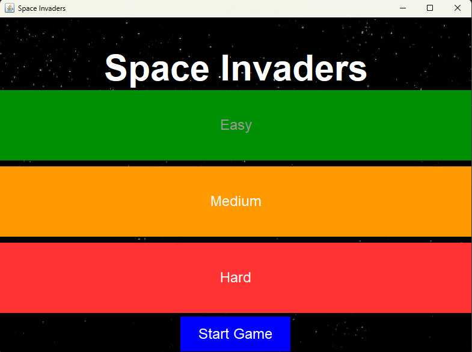
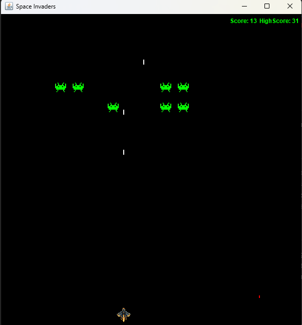

<div style="text-align:center; font-size: 30px; margin-bottom:100px;">

# Space Invaders
</div>

<div style="text-align:center;">

  

</div>


# Description


<div style="font-size:20px;">

 **Team Members**

</div>

   - **Deepak Sarun Yuvachandran**

   - **Charitha Vennapusala**  

   - **Nandini Reddy Bhumula**

Recreated by a passionate team, Space Invaders is a faithful homage to the beloved retro arcade game. Command your spaceship and defend Earth from relentless waves of alien invaders in this Java-based rendition. Featuring intuitive controls, multiple difficulty levels, and score tracking, the game offers a thrilling test of your reflexes and strategy. Whether you're reliving nostalgic memories or experiencing the excitement for the first time, Space Invaders captivates with its timeless gameplay and vibrant visuals. Immerse yourself in the retro charm and challenge your friends to beat your high score in this modern adaptation of a classic favorite.

# Features

- **Gameplay**: Navigate your spaceship to shoot down advancing aliens.
- **Difficulty Levels**: Choose from Easy, Medium, and Hard modes with escalating challenges.
- **Score Tracking**: Monitor your scores and aim for the highest record.
- **Interactive UI**: Engage with smooth, responsive Java Swing graphics.

# Technologies Used

- **Java**: Core programming language for game logic and UI.
- **Swing**: Java's GUI toolkit for creating interactive graphics.
- **Gradle**: Build automation for seamless execution and testing.
- **Serialization**: Save and load game progress and high scores.

# Getting Started

To launch Space Invaders on your machine:

1. **Clone the Repository**:
   ```bash
   git clone https://github.com/CSCI-5003/team-project-teamtwo.git
   ```

2. **Navigate to the Project Directory**:
   ```bash
   cd team-project-teamtwo
   ```

3. **Run the Game**:
   ```bash
   gradle run
   ```

4. **Game Controls**:
   - **Left** and **Right Arrow Keys**: Move spaceship horizontally.
   - **Spacebar**: Fire bullets at the aliens.

5. **Enjoy defending Earth from alien invasion!**

# Screenshots



# Contributing

Contributions to enhance Space Invaders are welcomed! Fork the repository, make improvements, and submit a pull request. For major changes, discuss them in an issue first.

# Acknowledgments

- Original game concept by Taito Corporation.
- Graphics and design inspired by classic arcade games.

---
